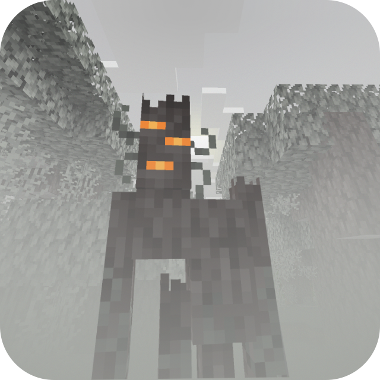

# Foggy Pale Garden Resource Pack

 

Resource Pack adds fog to the Pale Garden biome exactly as it appears in both vanilla and backporting mods.

---

This is a resource‑pack–based evolution of the [Foggy Pale Garden](https://modrinth.com/mod/foggypalegarden) mod, built on top of the capabilities provided by the [Polytone](https://modrinth.com/mod/polytone) and [Respackopts](https://modrinth.com/mod/respackopts) mods.

---

## ✨ Features

* Intelligent fog
* Settings & localization
* Presets

## 📥 Installation

Supported on all Minecraft versions and mod loaders that include Polytone v3 or higher.

1. Install the [Polytone](https://modrinth.com/mod/polytone) mod
2. Install the [Respackopts](https://modrinth.com/mod/respackopts) mod to access pack settings and presets
3. [Download](https://modrinth.com/resourcepack/foggypalegarden-rp) the resource pack and place it in your `resourcepacks` folder
4. Enable **Foggy Pale Garden** in the in‑game resource pack menu

## 🤗 Modpacks

You’re free to include this resource pack in modpacks without requesting permission.
