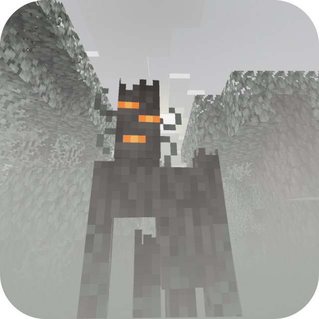
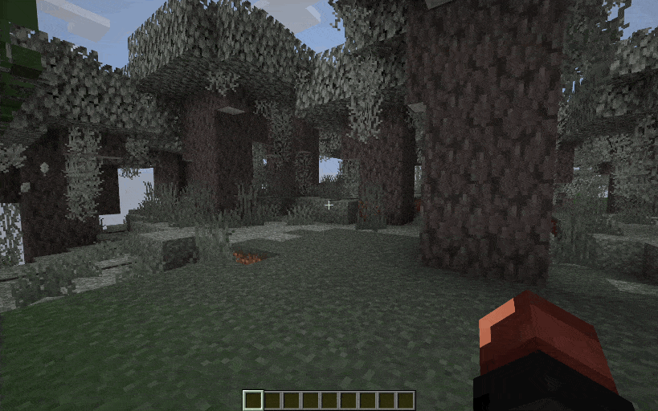
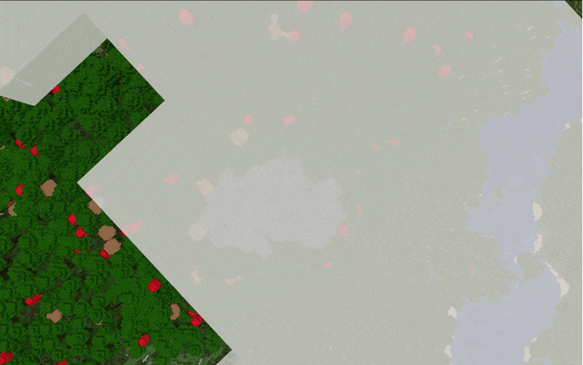
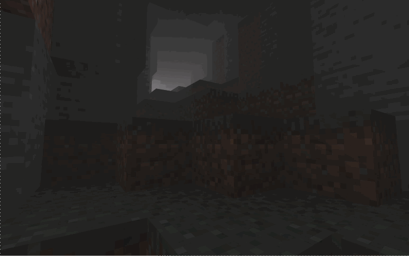
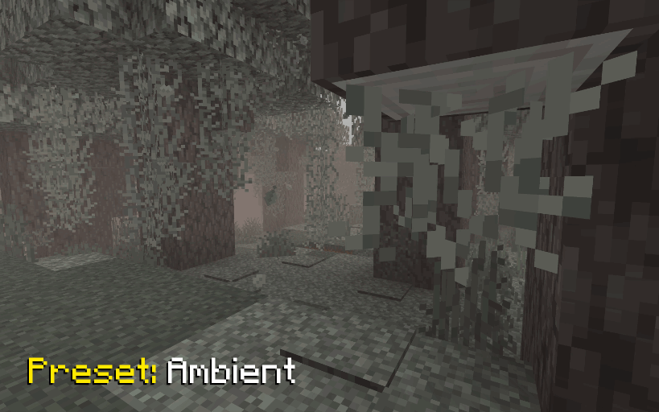
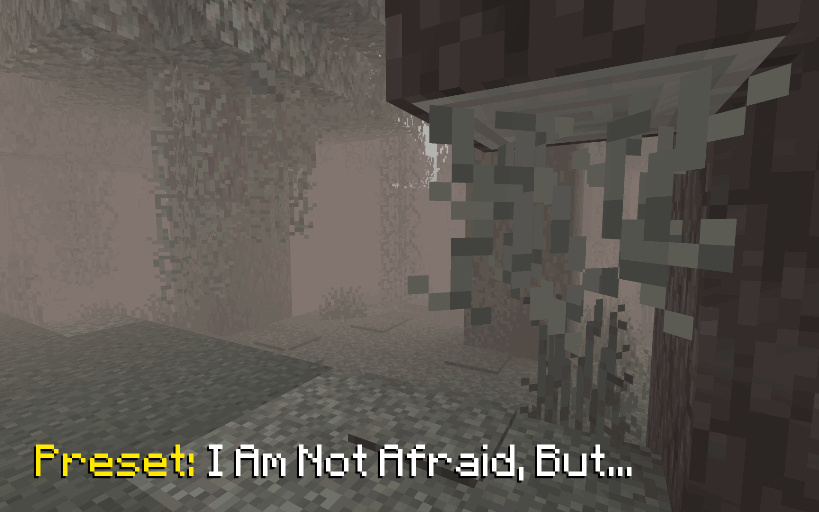
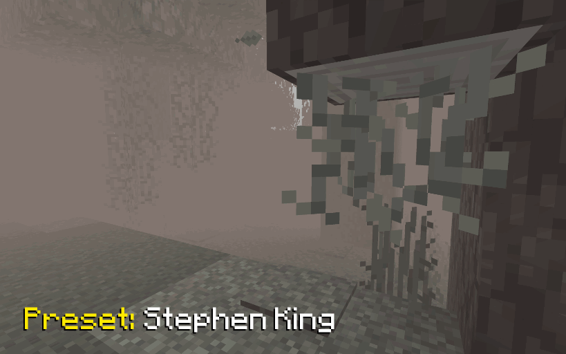

# Foggy Pale Garden Resource Pack

<a href="https://modrinth.com/resourcepack/foggypalegarden-rp">
  
</a>
<a href="https://www.curseforge.com/minecraft/texture-packs/foggypalegarden-rp">
  
</a>
<br/>
<br/>

Resource Pack adds fog to the Pale Garden biome in vanilla and compatible backporting mods.

---

This is a resource‑pack–based evolution of the [Foggy Pale Garden](https://modrinth.com/mod/foggypalegarden) mod, built on top of the capabilities provided by the [Polytone](https://modrinth.com/mod/polytone) and [Respackopts](https://modrinth.com/mod/respackopts) mods.

---



## ✨ Features

<details>
  <summary>🧠 Smart Fog in the Pale Garden Biome</summary>

The resource pack not only adds fog but also takes your convenience into account.

- 🪽 Fog dissipates when you fly over the biome above the cloud layer
  
- 🕳️ Fog dissipates when you descend into caves beneath the biome
  

</details>

<details>
  <summary>⏮️ Backport Support for “The Garden Awakens”</summary>

Fog is added to every biome named `pale_garden`, providing automatic compatibility with almost all Pale Garden backport mods.

Tested with:

- [Perfect Parity Neo: Pale Garden Awakens](https://modrinth.com/mod/perfect-parity-pale-garden-awakens)
- [I want it earlier 1.21.4](https://modrinth.com/mod/i-want-it-earlier)
- [Pale Garden and Creaking](https://www.curseforge.com/minecraft/mc-mods/pale-garden)
- [Pale Garden - Update](https://www.curseforge.com/minecraft/mc-mods/palegarden-update)
- [Vanilla Backport](https://modrinth.com/mod/vanillabackport)

</details>

<details>
  <summary>🔧 Visual Settings & Localization</summary>

With the [Respackopts](https://modrinth.com/mod/respackopts) mod, you can adjust the fog settings and use built‑in presets directly
from this resource pack.

- `Radius` – how far the fog extends from the player
- `Fade` – smoothness of fog dissipation
- `Minimum Sky Light` – the sky brightness threshold below which fog clears (useful for caves and mines)
- `Maximum Height` – the highest altitude at which fog appears (lets you fly above the biome without entering fog)

</details>

<details>
  <summary>🎨 Fog Density Presets</summary>

On Minecraft versions supported by Respackopts format 13 or newer, the pack’s settings include several ready‑to‑use presets with varying fog densities:

- `Ambient` – adds a light, atmospheric fog that doesn’t hinder movement
  <br/>
- `I Am Not Afraid, But...` – introduces a slightly denser fog
  <br/>
- `Stephen King` – a very thick fog that makes encountering a Creaking truly unexpected (just like in the novella *The Mist*)
  <br/>

</details>

## ✅ Supported Versions

Choose the archive that exactly matches the Minecraft version and loader.

| Minecraft | Loaders | Settings and presets | Intended channel |
|---|---|---|---|
| 1.20.1 | Fabric and Forge | Static default fog; Respackopts is not included | Beta |
| 1.21.1–1.21.5 | Fabric and NeoForge where matching mod builds exist | Settings and presets | Release |
| 1.21.10 | NeoForge only | Settings and presets | Beta |
| 1.21.11 | Fabric and NeoForge | Settings and presets | Release |
| 26.1.2 | Fabric and NeoForge | Settings and presets | Release |
| 26.2 | Fabric and NeoForge | Settings and presets | Release |

Minecraft 1.18, 1.19.x, 1.20.0, 1.20.2–1.20.6, and 1.21.6–1.21.9 do not have a published Polytone implementation that can provide this pack’s biome fog-distance behavior. Minecraft 1.21 is not shipped because no usable Pale Garden backport is available for that game version. Fabric 1.21.10 is also unsupported because its Polytone fog-shape hook is disabled.

## 📥 Installation

1. Install the latest matching [Polytone](https://modrinth.com/mod/polytone) build for your exact Minecraft version and loader.
2. For every configurable archive, install the matching [Respackopts](https://modrinth.com/mod/respackopts) build. The `1.20.1` archive is the exception and intentionally has no settings dependency on either loader.
3. [Download](https://modrinth.com/resourcepack/foggypalegarden-rp) the matching resource-pack archive and place it in your `resourcepacks` folder.
4. Enable **Foggy Pale Garden** in the in-game resource pack menu.

ZIP presets require Respackopts 4.13.6 or newer. The shared 1.20.1 archive is published in the beta channel, uses fixed default fog values, and contains neither settings nor presets.

## 🧪 Building and Verification

Run the complete target matrix:

```bash
./scripts/check.sh
```

The wrapper selects a compatible JDK when necessary and invokes the Gradle gate. Gradle discovers every `mcVersions/*.properties` target, builds and verifies the complete matrix, then places the checked ZIP files in `build/releases`. A single target can be built and verified with:

```bash
./scripts/check.sh 1.21.11
```

The corresponding Gradle commands are `./gradlew clean check` and `./gradlew clean verifyResourcePack -PmcVersion=1.21.11`. All target discovery, assembly, verification, publication modeling, and publication itself are implemented in Gradle/Groovy; the shell wrapper contains no build logic.

The automated gate verifies metadata, JSON, localization-key parity, target selection, Respackopts expansion, preset inclusion, unresolved placeholders, archive layout, ZIP integrity, and deterministic publication metadata. Visual fog behavior still requires in-game acceptance on every advertised loader.

## 🤗 Modpacks

You’re free to include this resource pack in modpacks without requesting permission.
