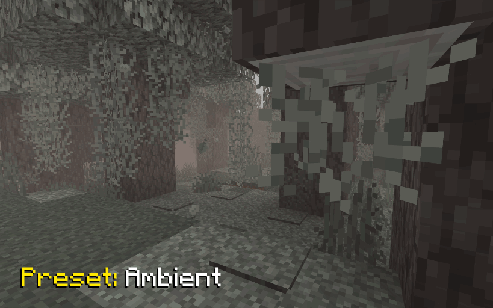

# Foggy Pale Garden Resource Pack

 
 

Resource Pack adds fog to the Pale Garden biome exactly as it appears in both vanilla and backporting mods.

---

This is a resource‑pack–based evolution of the [Foggy Pale Garden](https://modrinth.com/mod/foggypalegarden) mod, built on top of the capabilities provided by the [Polytone](https://modrinth.com/mod/polytone) and [Respackopts](https://modrinth.com/mod/respackopts) mods.

---

## ✨ Features

  
🧠 Smart Fog in the Pale Garden Biome

The resource pack not only adds fog but also takes your convenience into account.

- 🪽 Fog dissipates when you fly over the biome above the cloud layer
  
- 🕳️ Fog dissipates when you descend into caves beneath the biome
  

  
⏮️ Backport Support for “The Garden Awakens”

Fog is added to every biome named `pale_garden`, providing automatic compatibility with almost all Pale Garden backport mods.

Tested with:

- [Perfect Parity Neo: Pale Garden Awakens](https://modrinth.com/mod/perfect-parity-pale-garden-awakens)
- [I want it earlier 1.21.4](https://modrinth.com/mod/i-want-it-earlier)
- [Pale Garden and Creaking](https://www.curseforge.com/minecraft/mc-mods/pale-garden)
- [Pale Garden - Update](https://www.curseforge.com/minecraft/mc-mods/palegarden-update)
- [Vanilla Backport](https://modrinth.com/mod/vanillabackport)

  
🔧 Visual Settings & Localization

With the [Respackopts](https://modrinth.com/mod/respackopts) mod, you can adjust the fog settings and use built‑in presets directly
from this resource pack.

- `Radius` – how far the fog extends from the player
- `Fade` – smoothness of fog dissipation
- `Minimum Sky Light` – the sky brightness threshold below which fog clears (useful for caves and mines)
- `Maximum Height` – the highest altitude at which fog appears (lets you fly above the biome without entering fog)

  
🨠Fog Density Presets

In the pack’s settings you’ll find several ready‑to‑use presets with varying fog densities:

- `Ambient` – adds a light, atmospheric fog that doesn’t hinder movement
  
- `I Am Not Afraid, But...` – introduces a slightly denser fog
  
- `Stephen King` – a very thick fog that makes encountering a Creaking truly unexpected (just like in the novella *The Mist*)
  

## 📥 Installation

Supported on all Minecraft versions and mod loaders that include Polytone v3 or higher.

1. Install the [Polytone](https://modrinth.com/mod/polytone) mod
2. Install the [Respackopts](https://modrinth.com/mod/respackopts) mod to access pack settings and presets
3. [Download](https://modrinth.com/resourcepack/foggypalegarden-rp) the resource pack and place it in your `resourcepacks` folder
4. Enable **Foggy Pale Garden** in the in‑game resource pack menu

## 🐞 Known Bugs

### Presets Not Applied from Zip Archive

Currently, presets are indeed not applied if the resource pack is loaded as a zip archive. However, they are successfully applied if it is loaded as a folder.

It appears to be an issue with Respackopts. I have opened an issue in their tracker https://youtrack.frohnmeyer-wds.de/issue/RPO-40

## 🤗 Modpacks

You’re free to include this resource pack in modpacks without requesting permission.